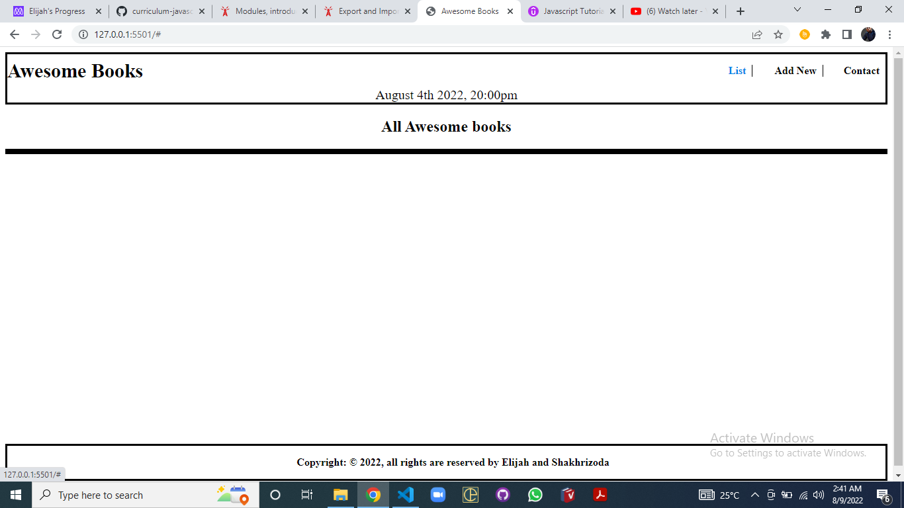
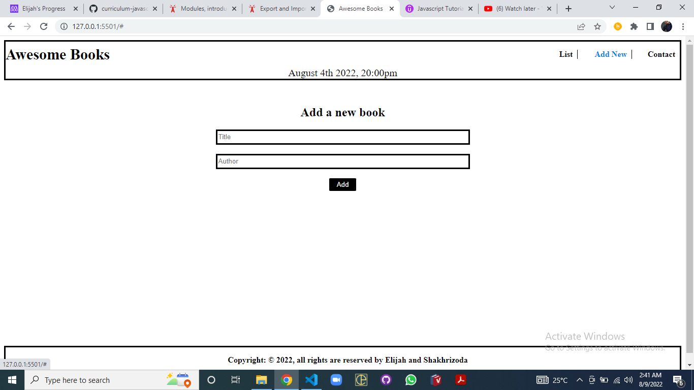
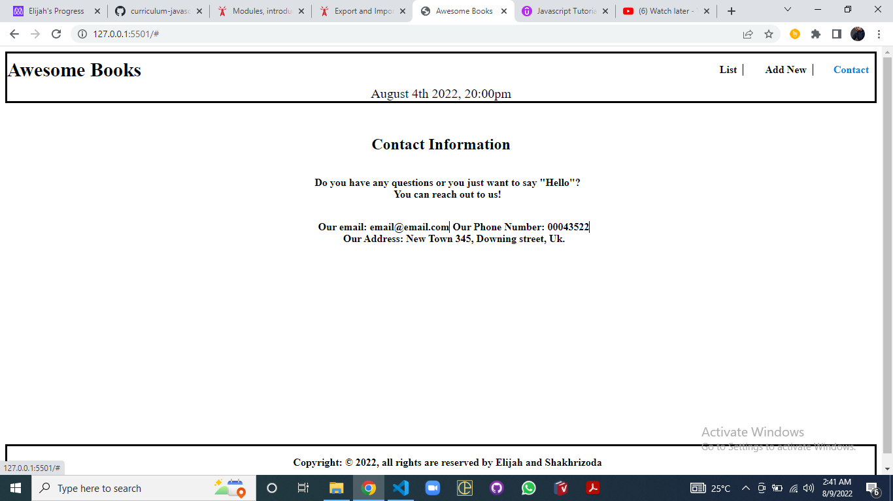

# Awesome Books.
> This is a book collection management web application which will help the user to add book with the Title and the Author to the books collection
and also remove any book from the collection. In addition, he/she will be able to see the book list in the collection on the landing page.

## Built With

- HTML and CSS 
- plain Javascript

## How to use and run this project
>To get a local copy up and running follow these simple example steps.

-Clone this repository with

<code> git clone  </code>
using your terminal or command line.

-Change to the project directory by entering :

<code>cd Refactoring-Awesome-books</code>, in the terminal.

-run code to open it in vscode.
However, there are some project requisites required for this project to run properly 
### Prerequisites
- This project makes use of dependency library called "luxon"
- To install it, follow this:
- Locate to the directory of the project
- In the terminal, <code>npm init -y</code> to initialise the package manager
- Again, in the terminal, <code> npm install --save luxon </code> to install the library

## Project Status
This project has been  finished and deployed.

## Screenshoots

## Live Demo link
  https://elijahdre.github.io/Awesome-books-es6/

## Issues

Up to now, there are no issues with it.

Here is the link to the Issues tab:

Feel free to check the [issues page.](https://github.com/Elijahdre/Awesome-books-es6/issues)

## Author

👤 Elijah Andre

- GitHub: [@elijahdre](https://github.com/Elijahdre)
- LinkedIn: [Elijah Odjegba](https://www.linkedin.com/in/elijah-odjegba-862708179/)

## Show your support

Give a ⭐️ if you like this project!

## Acknowledgments

Thanks to everyone who helped me.
